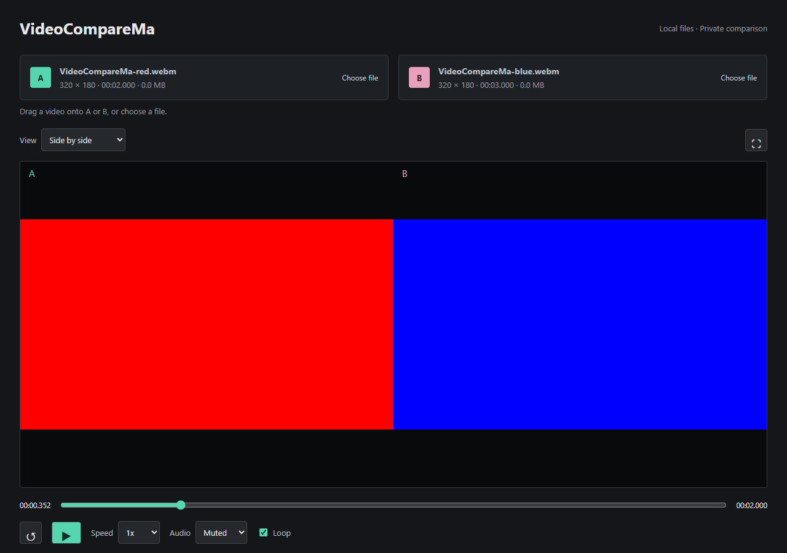

# VideoCompareMa

A small, dependency-free browser tool for comparing two local video files.

- Horizontal and vertical side-by-side views
- A/B wipe with a draggable, keyboard-accessible divider in either direction
- Adjustable transparency and absolute RGB difference with gain
- Shared playback, seeking, speed, loop, and audio source controls
- Local-only files; no uploads or backend
- Drag a video directly onto either highlighted source slot, or choose a file

Open `index.html` in a modern browser. Deploy the three static files using [deploy.md](./deploy.md).

Live app: [VideoCompareMa on GitHub Pages](https://RmaNMetaverse.github.io/VideoCompareMa/). Pushes to `main` deploy automatically through the included GitHub Actions workflow.

Browser codec support applies. Playback synchronization is approximate; difference output is based on scaled browser-decoded frames. See the deployment guide for precise limitations.
